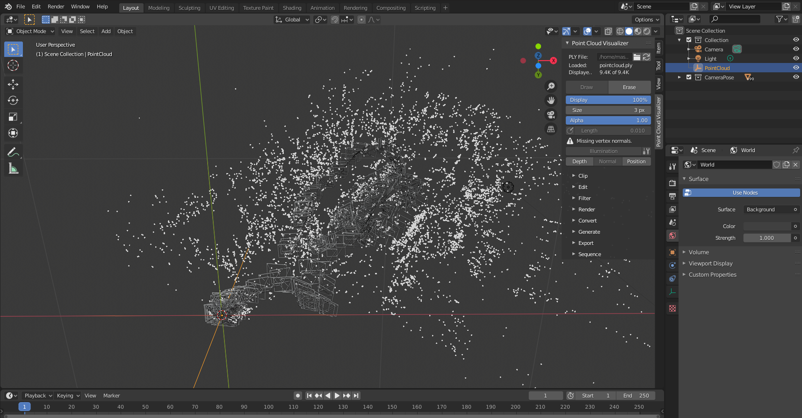

# SLAM Visualizer on Blender

With this code, it is possible to visualize the result of SLAM, the point cloud and the camera pose, using Blender.

# 1. Test Environment

- Ubuntu 20.04 LTS
- Blender 2.82
- [ORB_SLAM2](https://github.com/raulmur/ORB_SLAM2)

# 2. Installation

- Install [Point Cloud Visualizer](https://github.com/uhlik/bpy) in Blender

# 3. Usage

- Use ORB_SLAM and Output trajectory and point cloud
- Put trajectory and point cloud in data folder
- Rewrite `poses_file_path` to the place of KeyFrameTrajectory.txt
- Load point cloud using Point Cloud Visualizer
- Choose `Scripting` tab on blender and `Run Script`

You can output PointCloud with ORB_SLAM2 by rewriting `SaveKeyFrameTrajectoryTUM` in [system.cc](https://github.com/raulmur/ORB_SLAM2/blob/f2e6f51cdc8d067655d90a78c06261378e07e8f3/src/System.cc#L383) using the code of [`script/OutputPointCloud.cc`](script/OutputPointCloud.cc)

Note that it can be applied to other VO and SLAM results by changing the format of the camera pose input.
